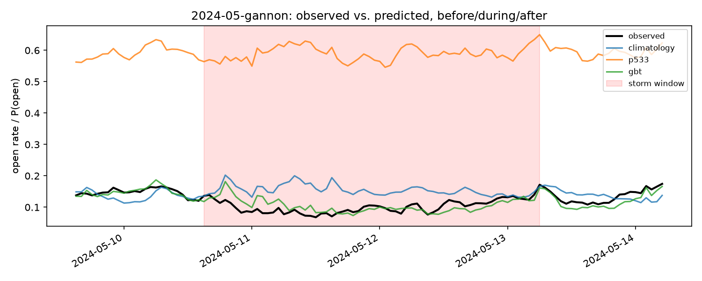
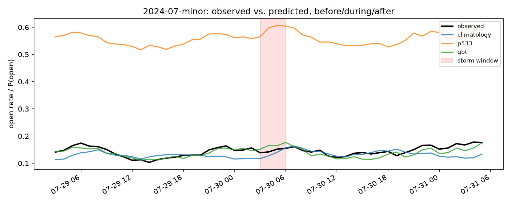
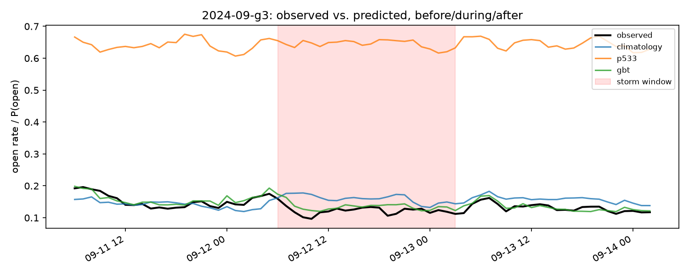

# Storm-window case studies (PRO-11)

Three storms, one per M3 eval month (2024-05/07/09), picked from
`data/cache/gfz_kp.txt`'s definitive Kp record. Each is sliced into
before/during/after (24h padding either side of the contiguous Kp>=5 block)
using `scripts/eval_storm_case_studies.py`, reusing ADR 0006's training
scheme (train 2024-01/02/03, band=20m). Full per-period reliability
diagrams and raw headline tables are under
`data/reports/storm_case_studies/` (gitignored, reproducible via the
script); this doc is the committed summary.

| storm | max Kp | window (UTC) |
|---|---|---|
| 2024-05-gannon | 9.0 | 2024-05-10 15:00 -- 2024-05-13 06:00 |
| 2024-07-minor | 5.3 | 2024-07-30 03:00 -- 2024-07-30 06:00 (weakest storm in any M3 eval month) |
| 2024-09-g3 | 7.3 | 2024-09-12 06:00 -- 2024-09-13 03:00 |

## Headline: Brier score, h=0, band=20m

| storm | period | climatology | P.533 | **GBT** | n |
|---|---|---|---|---|---|
| 2024-05-gannon | before | 0.0813 | 0.3986 | **0.0440** | 368,488 |
| 2024-05-gannon | during | 0.0736 | 0.4254 | **0.0408** | 734,344 |
| 2024-05-gannon | after | 0.0773 | 0.4060 | **0.0430** | 352,918 |
| 2024-07-minor | before | 0.0788 | 0.3720 | **0.0461** | 390,930 |
| 2024-07-minor | during | 0.0785 | 0.3988 | **0.0494** | 37,562 |
| 2024-07-minor | after | 0.0792 | 0.3701 | **0.0484** | 353,181 |
| 2024-09-g3 | before | 0.0767 | 0.4460 | **0.0454** | 356,479 |
| 2024-09-g3 | during | 0.0680 | 0.4649 | **0.0439** | 253,186 |
| 2024-09-g3 | after | 0.0737 | 0.4585 | **0.0441** | 286,205 |

GBT beats both baselines in every period of every storm, storm windows
included. The more striking pattern: **P.533 gets measurably worse during
the storm in 2 of 3 cases** (Gannon: 0.3986 -> 0.4254; 2024-09-g3: 0.4460 ->
0.4649) while GBT stays essentially flat or improves slightly (Gannon:
0.0440 -> 0.0408; 2024-09-g3: 0.0454 -> 0.0439) — exactly the ARCHITECTURE.md
§6 expectation ("storms are where climatology fails hardest and the model
should win biggest"), except here it's P.533, not climatology, that
degrades most under storm conditions. Climatology itself is roughly flat to
mildly *better* during storms in this data (its Brier score is dominated by
the marginal-band base rate, not storm dynamics).

## Timelines

Hourly-binned observed open rate vs. each model's mean predicted P(open),
storm window shaded:

The Gannon plot is the clearest illustration: P.533 sits flat around
0.55-0.65 throughout (disconnected from what's actually happening), while
GBT tracks the observed rate's storm-window dip closely. 2024-07's minor
storm (Kp 5.3, much weaker) shows a proportionally smaller but still visible
effect.

## Caveats

- Single band (20m), h=0 only -- not the full band-group x horizon sweep
  ADR 0006's headline result covers. Chosen to keep this script's runtime
  bounded (ADR 0006 documents real OOM risk from multi-band concurrent
  extraction on this machine).
- Per-band GBT (not the shared-across-bands model architecture intends),
  same caveat ADR 0006 already flags for its own headline numbers.
- 2024-07 had no Kp>=6 period at all -- its "storm" is the strongest
  available that month (Kp 5.3), not comparable in severity to the other
  two. Included anyway to keep one case study per M3 eval month.
